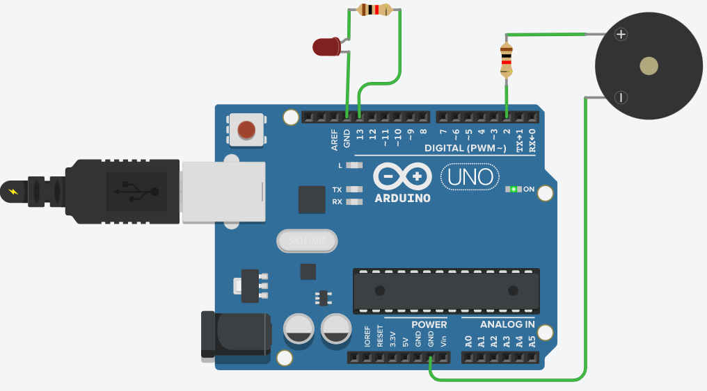

<h1 align="center">IntelliDrive Drowsiness Detector</h1>

<div align= "center">
  <h4>Inspired by the increasing number of accidents caused by drowsy driving, IntelliDrive Drowsiness Detector employs image processing and deep learning to identify driver fatigue and provides a 5-second alert to prevent incidents.
  </h4>
</div>


## :file_folder: Files Included

The repository includes the following important files:

- `dataset`: directory containing the dataset used for training the machine learning model.
- `face_detector`: directory containing code for the facial detection technique used in the project.
- `detect_drowsiness_video.py`: the main code for detecting drowsiness in drivers using video input.
- `eye_detector.model`: the trained machine learning model for detecting eye states.
- `requirements.txt`: file containing the required Python libraries for the project.
- `training.py`: the code for training the machine learning model.

## 🔏 Prerequisites

All the dependencies and required libraries are included in the file `requirements.txt`. You need to have Python 3 installed on your system.

## ⬇️ Installation

1. Clone the repo

```
$ git clone https://github.com/ahnngo/intellidrive-drowsiness-detector.git
```

2. Change your directory to the cloned repo 

```
$ cd intellidrive-drowsiness-detector
```

3. Now, run the following command in your Terminal/Command Prompt to install the libraries required

```
$ pip3 install -r requirements.txt
```

## :gear: Hardware Set Up
### Arduino Board
To run this program, you will need the following components connected to your Arduino board:

- An LED connected to pin 13 (or the pin number specified by the "LED" variable in the code).
- A speaker connected to pin 2 (or the pin number specified by the "SPEAKER" variable in the code).


Make sure to properly connect these components to your Arduino board before uploading the code. Here is a breadboard for reference. 



### Port Setup

Please note that the port used in this code may not be compatible with your computer. After uploading the code to the Arduino board, check which port it is using. Then, open the send_serial_testing.py file located in the same repository, and modify the first argument of the arduino = serial.Serial() function to match the port used by your Arduino board.

For example, if your Arduino board is using port COM3 on Windows or /dev/tty.usbmodem14101 on macOS, change the following line in the send_serial_testing.py file:

```
arduino = serial.Serial('COM9', baudrate=9600, timeout=1)
```
to:
```
arduino = serial.Serial('COM3', baudrate=9600, timeout=1)
```
Save the changes to the send_serial_testing.py file and run it to test the code. If COM3 does not work for your computer, you can check which port the Arduino is connected to by opening the Arduino IDE, navigating to Tools > Port, and selecting the port that shows up when the Arduino is connected. Then, modify the arduino = serial.Serial() function in your Python script to use the selected port.


## 💻 Working

1. Open a terminal. Go into the cloned project directory and type the following command to train the machine learning model:

```
$ python3 training.py --dataset dataset
```

2. To detect drowsiness in drivers using video input, type the following command:

```
$ python3 detect_drowsiness_video.py
```

**Note:** Before running detect_drowsiness_video.py, make sure to close the Arduino IDE to avoid any port occupation conflicts.

## 👷 Contributors

The following people have contributed to the project:

- [Anh (Alec) Ngo](https://github.com/ahnngo)
- [Anh Le](https://github.com/anhle1008)
- [Nelson Xunic](https://github.com/NelsonXunic)

## 💚 Reference
This project uses some code components of the Face Mask Detection repository by Chandrika Deb:

[Deb, Chandrika. (2020). Face-Mask-Detection.](https://github.com/chandrikadeb7/Face-Mask-Detection)
